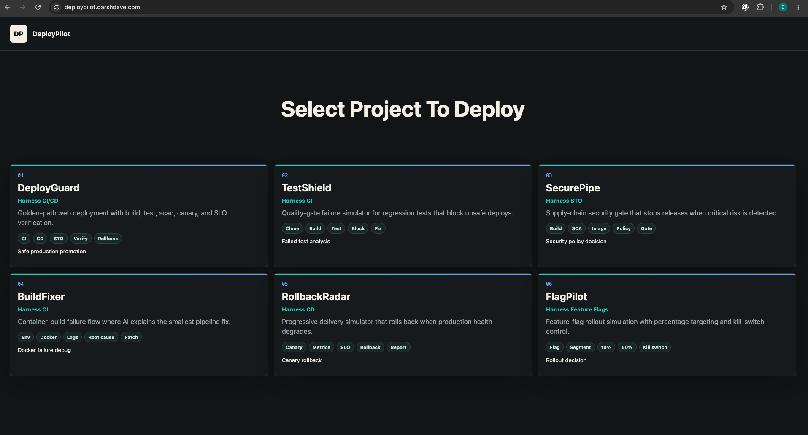
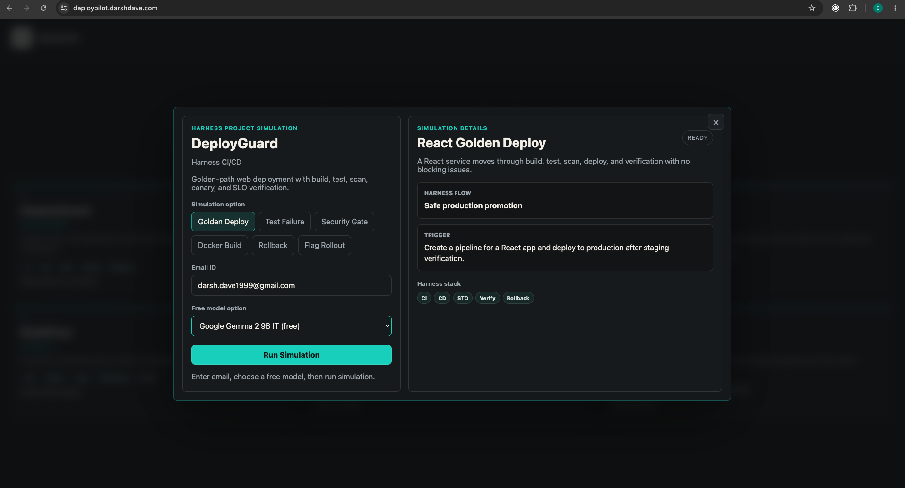
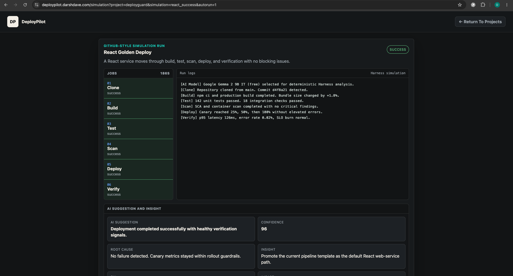

# DeployPilot

AI DevOps control-plane simulation for portfolio demos.

**Live website:** [deploypilot.darshdave.com](https://deploypilot.darshdave.com/)  
**Portfolio:** [darshdave.com](https://darshdave.com/)  
**Repository:** [github.com/darshdevlab/DeployPilot](https://github.com/darshdevlab/DeployPilot)

DeployPilot opens with a Harness simulation-project selector, then lets visitors run the selected DevOps flow. The simulator asks a tester for an email address, runs a Harness-style CI/CD simulation, generates an AI-style analysis, and saves run history. The MVP is static and Vercel-ready, with Supabase persistence available through the included schema and `config.js`.

## Screenshots

### Project Selector



### Project Simulation Popup



### Simulation Logs And AI Insight



## Features

- Email-only user-test capture
- First-screen selector with six Harness simulation projects
- Project cards open a popup simulation card with project details, email ID, simulation option tabs, and free model selection
- Popup can close from the top-right cross or by clicking outside the card
- Run Simulation opens the full GitHub Actions-style logs and AI insight page
- Six simulation types
- Animated pipeline timeline
- Failure analysis and suggested fix
- Harness-style YAML preview
- Saved run history
- Supabase adapter with localStorage fallback

## Run Locally

```bash
npm test
npm run serve
```

Then open `http://127.0.0.1:8787`.

## Supabase Setup

1. Apply `supabase/schema.sql` to the intended Supabase project.
2. Copy `config.example.js` to `config.js`.
3. Set `supabaseUrl` and `supabasePublishableKey`.

Use only a publishable key in `config.js`. Do not expose a service-role key in this static app.

## Deploy

This folder can be deployed directly to Vercel as a static project.
